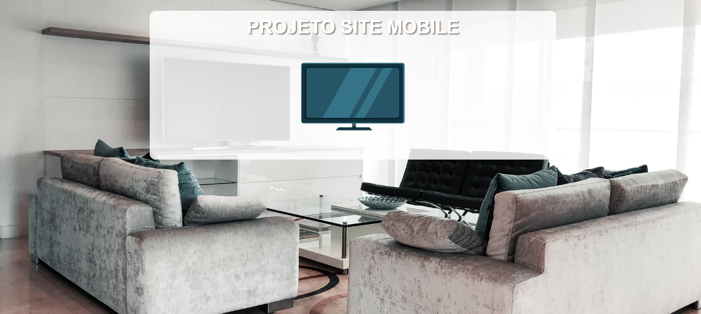

# SITE MOBILE
👨‍🏫PROJETO FEITO PARA O CURSO DE HTML E CSS DO CURSO EM VIDEO.

   
   
   
   

## DESCRIÇÃO:
Este projeto demonstra a implementação de um layout responsivo usando HTML, CSS e media queries. Ele oferece uma experiência de usuário consistente e adaptável em uma variedade de dispositivos e tamanhos de tela. O projeto "Site Mobile" apresenta um layout responsivo que se adapta a diferentes dispositivos, como smartphones, tablets, desktops e TVs. Aqui estão os principais recursos do projeto:

- **Layout Responsivo:**
  - O layout do site se ajusta dinamicamente ao tamanho da tela do dispositivo em que está sendo visualizado.
  - São fornecidas imagens representativas de diferentes tipos de dispositivos: celular, tablet, impressora, desktop e TV.

## EXECUTANDO O PROJETO:
1. Abra o arquivo `CODIGO.html` em um navegador da web.
2. Visualize o site em diferentes dispositivos, redimensionando a janela do navegador ou utilizando as ferramentas de desenvolvedor do navegador para simular dispositivos específicos.
3. Observe como o layout e as imagens do site mudam de acordo com o tamanho da tela do dispositivo.
4. Experimente a visualização em modo de impressão para ver como o site é apresentado quando impresso.

## NÃO SABE?
- Entendemos que para manipular arquivos em `HTML`, `CSS` e outras linguagens relacionadas, é necessário possuir conhecimento nessas áreas. Para auxiliar nesse aprendizado, oferecemos cursos gratuitos disponíveis:
* [CURSO DE HTML E CSS](https://github.com/VILHALVA/CURSO-DE-HTML-E-CSS)
* [CURSO DE JAVASCRIPT](https://github.com/VILHALVA/CURSO-DE-JAVASCRIPT)
* [CONFIRA MAIS CURSOS](https://github.com/VILHALVA?tab=repositories&q=+topic:CURSO)

## CREDITOS:
- [PROJETO FEITO PELO VILHALVA](https://github.com/VILHALVA)
- [PROJETO FEITO PARA O CURSO DE HTML E CSS](https://github.com/VILHALVA/CURSO-DE-HTML-E-CSS)
- [ESTÁ DISPONIVEL NO SITE](https://vilhalva.github.io/STYLER/STYLER.html)
